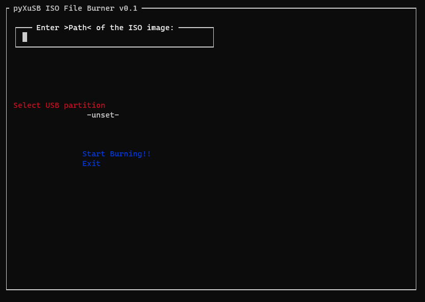

# pyXuSB
 

- [x] Usage: ```sudo python3 pyXuSB.py```

# Screenshot


# Updates
<b>04/12/2020</b>
- [x] README is fixed.

# Setup
<b>Necessary python modules</b>
- ```npyscreen``` => <i>Creating TUI.</i>
- ```psutil``` => <i>Enumerating disk partitions</i>
