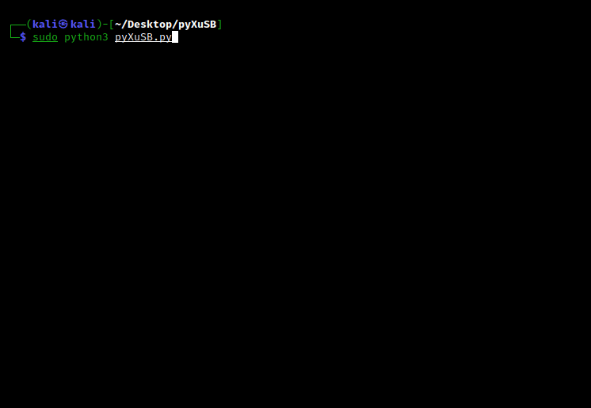

# pyXuSB
 

- [x] Usage: ```sudo python3 pyXuSB.py```

# Screenshot


# Usage


# Updates
<b>08/12/2020</b>
- [x] Critical bug: ```Process handling``` is fixed. Now you can flash your ISO files successfully.

# Setup
<b>Necessary python modules</b>
- ```npyscreen``` => <i>Creating TUI.</i>
- ```psutil``` => <i>Handling processes such as dd and mkfs.</i>

<b>Installation of python modules</b>: ```sudo pip3 install -r requirements.txt```
